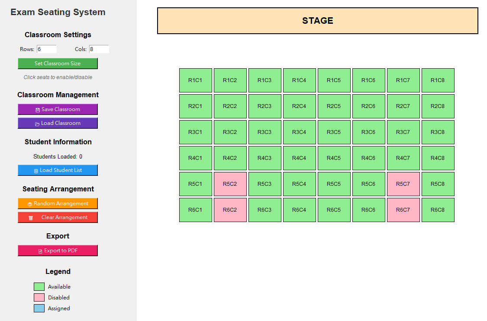

# Exam Seating System

A comprehensive GUI application for generating and managing exam seating arrangements. Built with Python and Tkinter, this tool helps educators efficiently assign students to seats while accommodating various classroom layouts.


## Features

### 🏫 Flexible Classroom Configuration
- Define custom classroom dimensions (M × N grid)
- Visual stage/platform indicator at the front
- Enable/disable specific seats to match actual classroom layouts
- Save and load classroom configurations for reuse

### 👥 Student Management
- Import student lists from CSV files
- Interactive column selector for flexible CSV formats
- Supports UTF-8 and Big5 encodings
- Real-time student count display

### 🎲 Seating Arrangement
- Random seat assignment with one click
- Visual color-coded seat status:
  - **Green**: Available seats
  - **Pink**: Disabled seats
  - **Blue**: Assigned seats
- Easy clearing and rearrangement

### 📄 PDF Export
- Professional seating chart generation
- Landscape A4 format for optimal viewing
- Includes stage indicator and student names
- Ready for printing or digital distribution

## Installation

### Prerequisites
- Python 3.7 or higher
- pip package manager

### Required Libraries
```bash
pip install pandas reportlab
```

### Download
```bash
git clone https://github.com/JamesLin102/Seating-System.git
cd exam-seating-system
```

## Usage

### Starting the Application
```bash
python exam_seating_system.py
```

### Step-by-Step Guide

1. **Configure Classroom**
   - Enter the number of rows (M) and columns (N)
   - Click "Set Classroom Size"
   - Click on seats to disable them (matching your classroom layout)

2. **Save Classroom Configuration** (Optional)
   - Click "💾 Save Classroom" to save the layout
   - Load it later with "📂 Load Classroom"

3. **Import Students**
   - Click "📋 Load Student List"
   - Select your CSV file
   - Choose the column containing student names

4. **Arrange Seats**
   - Click "🎲 Random Arrangement" to automatically assign students
   - Use "🗑️ Clear Arrangement" to start over

5. **Export Results**
   - Click "📄 Export to PDF"
   - Save the seating chart for distribution or printing

## CSV File Format

Your CSV file can have any structure. The application will let you select which column contains student names.

**Example CSV:**
```csv
Student ID,Name,Class,Grade
001,John Smith,A,10
002,Jane Doe,B,10
003,Bob Johnson,A,10
```

Just select the "Name" column when prompted.

## Classroom Configuration File

Classroom configurations are saved as JSON files:

```json
{
  "rows": 6,
  "cols": 8,
  "disabled_seats": ["0,0", "0,7", "5,0", "5,7"]
}
```

## Troubleshomarks

### CSV Not Loading
- Ensure the file is a valid CSV format
- Check file encoding (UTF-8 or Big5 supported)
- Verify the file contains at least one column

### PDF Export Issues
- The application will attempt to use system Chinese fonts
- Falls back to Helvetica if Chinese fonts unavailable
- Ensure write permissions for the output directory

### Seat Assignment Errors
- Number of students cannot exceed available seats
- Clear any existing arrangement before modifying seat layout

